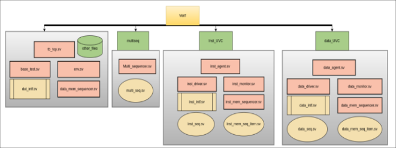
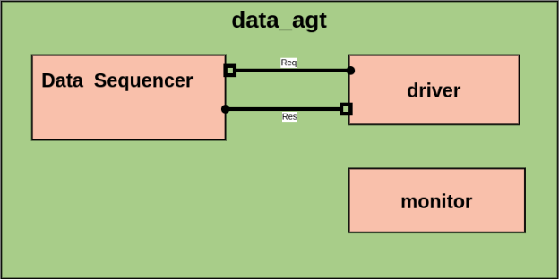
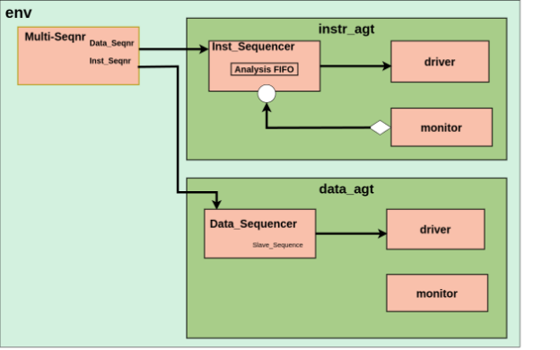
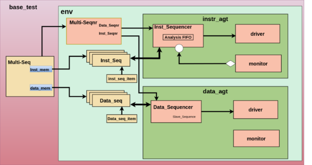
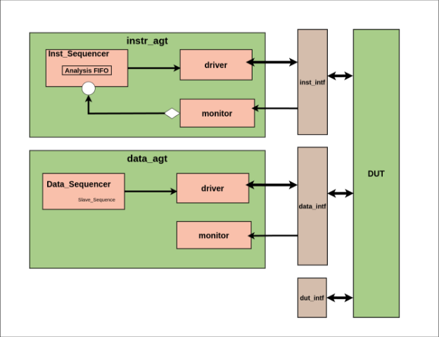
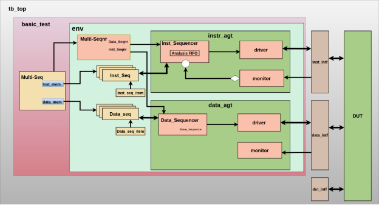

SOC DV   	 									[Ahmed Raza](mailto:ahmed.raza@10xengineers.ai)

**UVM Capstone Project**

**Verification of Fetch Unit and LSU of IBEX Core** 

The project files are present in the GitHub repository below:

[Programming Task | GitHub Repository](https://github.com/ahmed-10xe-dv/UVM1/tree/main/Codes/uvm_capstone_part-i/part-i)

**Directory Structure:**

The *verif* directory contains the core components of the verification environment, including interface definitions, verification packages, and agents for instruction and data handling. It features UVM components like monitors, drivers, and sequencers organized under *inst\_uvc* and *data\_uvc*, providing modular verification for instruction and data transactions. Additionally, the directory includes the environment configuration (*env.sv*), the testbench top module (*tb\_top.sv*), and supporting packages like *bus\_params\_pkg.sv* and *mem\_model\_pkg.sv* for modeling and parameterization.

The *tests* directory houses various assembly test programs and binaries for functional and performance validation of the DUT. It includes individual test cases (*example*.*S*, *init\_regs*.*S*) and grouped tests under the *assembly\_test* folder, which focuses on specific scenarios like arithmetic operations and user-defined initialization. Test artifacts such as binaries (.*bin*), assembly files (.*ass*), and executable files (.*elf*) ensure seamless integration and execution during simulations.

**Components of the Verification Environment**

The **Instruction Agent** is a key part of the Inst UVC. It encapsulates the driver, monitor, and sequencer for instruction-related functionality. This component is responsible for connecting Sequencer and Monitor, and Sequencer and Driver. 

The **Data Agent** is part of the Data UVC, combining the driver, monitor, and sequencer for verifying data transactions. It connects the Data Sequencer and Data Driver.

**Environment:**

The **env class** sets up the core verification environment by creating and managing the **data agent**, **instruction agent**, and **virtual sequencer**. During the **build phase**, it initializes these components, and in the **connect phase**, it connects the agents' sequencers to the virtual sequencer for coordinated operation. This class serves as a central hub for managing the UVCs and ensures seamless interaction between them.

**Base Test:**

The **base\_test class** serves as the foundation for the verification environment. It initializes the environment, virtual sequence, and memory model while managing the DUT's setup and binary file loading. It also monitors for specific instructions like ECALL to adjust DUT behavior dynamically. This class ensures a streamlined test flow by integrating interfaces, processing command-line arguments, and running sequences.

**Interfaces:**

The **data\_intf** interface facilitates communication between the Load-Store Unit (LSU) and memory using parameterized signals from **bus\_params\_pkg**. It includes clocking blocks for the driver and monitor to simplify signal synchronization and access. Utility tasks for waiting on clock edges enhance flexibility for simulation control.

The **inst\_intf** interface handles communication between components for instruction fetching, using parameters from **bus\_params\_pkg**. It provides driver and monitor clocking blocks for seamless access to signals like requests, addresses, and data. Utility tasks for clock edge waits offer easy control over simulation timing.

The **dut\_intf** interface centralizes signals for the **ibex\_top** module, including instruction and data memory interfaces and CPU control signals. It manages signals like fetch enable, read/write requests, and address/data buses. This simplifies instantiation and integration in **tb\_top**.

**Tb Top:**

The **tb\_top module** serves as the top-level testbench for UVM-based verification, instantiating clock, reset, and DUT interfaces. It includes the DUT (ibex\_top\_tracing), connects its ports to the instruction and data interfaces, and sets up UVM virtual interfaces for simulation. Key configurations and UVM tests are initialized, with clock and reset generation included for seamless operation. It starts the base test.

### **How the Test Starts?**
The **test starts** by initializing the **base\_test**, which loads the binary file (provided as a command-line argument at simulation runtime) into the memory model. This memory is shared with the instruction and data sequences. Both sequences are then started on their respective sequencers, with the instruction sequencer interacting with its driver using the analysis FIFO method, while the data sequencer employs the slave sequence method for communication with the data driver.
### **How the Test Ends?**
The **test ends** when the **ecall detection mechanism** in the base test, running in a parallel thread (fork-join\_any), identifies an **ecall instruction**. Upon detection, the fetch enable signal is halted, effectively pausing instruction fetches and terminating the program execution.

## **Project Setup**
To begin, clone the project repository: 

***git clone [https://github.com/ahmed-10xe-dv/UVM1/tree/main/Codes/uvm_capstone_part-i/part-i***](https://github.com/ahmed-10xe-dv/UVM1/tree/main/Codes/uvm_capstone_part-i/part-i)***

***cd uvm\_capstone\_part-i/part-i***

Verify that the following directories and files are present:

- **RTL/**: Contains RTL files (e.g., rtl/ibex\_top\_tracing.sv).
- **VERIF/**: Contains verification environment files (e.g., verif/tb\_top.sv).
- **TESTS/**: Contains assembly test files (e.g., tests/init\_regs.S).

**Directory and File Organization**

Upon execution, the Makefile generates output directories as follows:

- out/: Root output directory.
  - out/seed-<SEED>/: Simulation-specific directory generated using the timestamp as a seed.
    - INCA\_libs/: Stores compiled simulation libraries.
    - test/: Stores generated ELF, binary, and disassembled files for assembly tests.
###  Local Compilation of Assembly Files
***make bin <path\_to\_S\_file>***  

It will create the following files at the same path of S file. 

<test\_name>.bin  

<test\_name>.elf  

<test\_name>.ass  

**Example:**

***make bin tests/init\_regs.S***  

The outputs will be stored in the same directory as the source .S file.
### Compiling RTL and Testbench
***make test-compile***  

This step generates the simulation executable and stores it in the out/seed-<SEED> directory.
### Running the Simulation
To execute the simulation with the compiled binary, use:

***make sim ASM\_TEST=<path to binary >.bin***  
### Generating Detailed Coverage Reports
***make detailed-cov***  

For graphical coverage visualization, use:

***make cov-gui***  

This launches Synopsys DVE, allowing in-depth analysis of coverage data.

To remove all generated files and directories, execute:

***make clean***  

This resets the project to its initial state, ensuring a clean environment for subsequent runs.
` 										           `Dec 6, 2024
